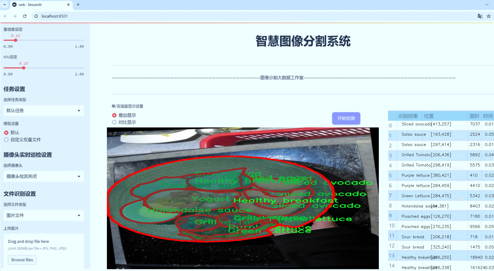
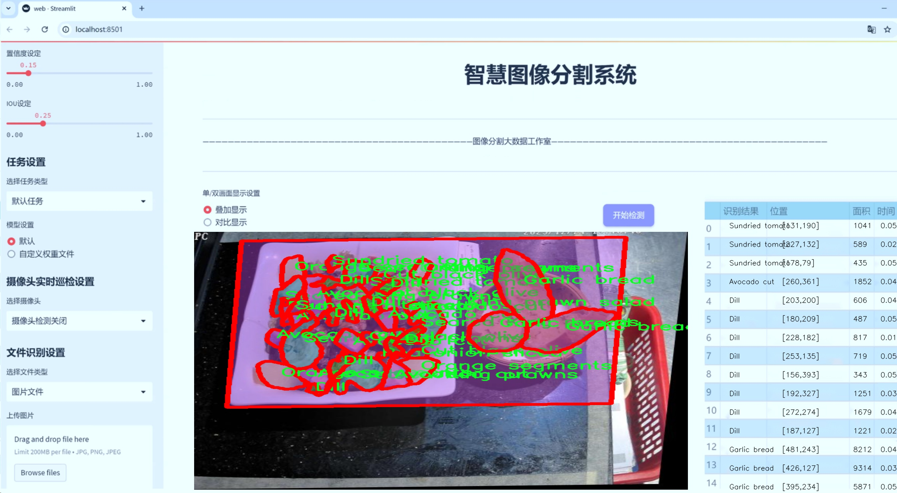
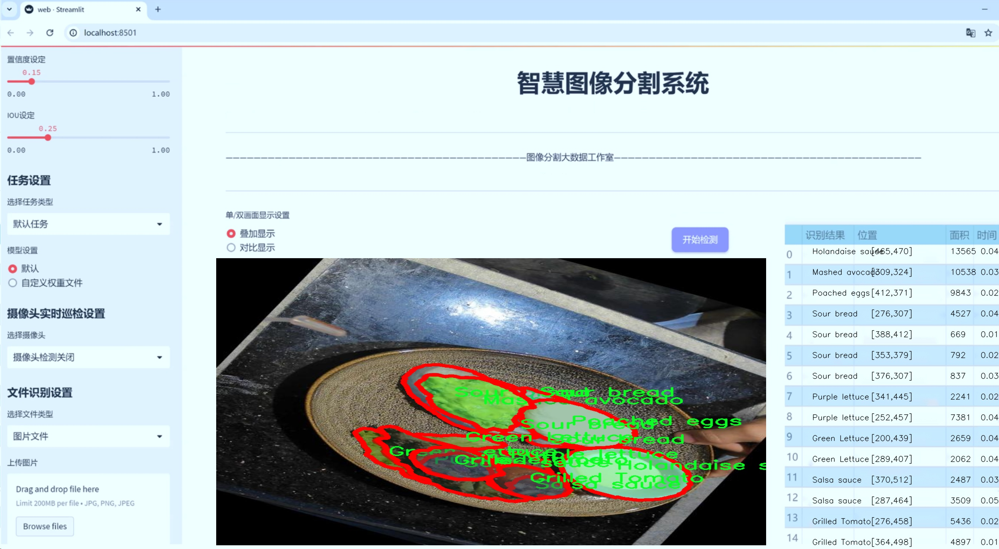
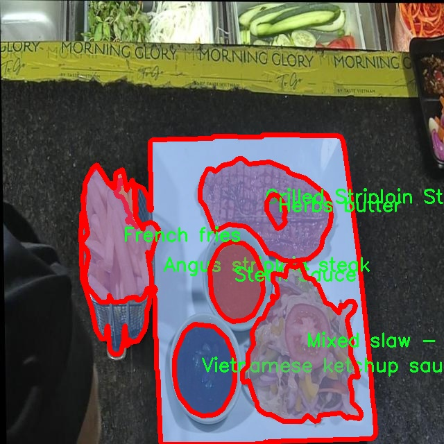
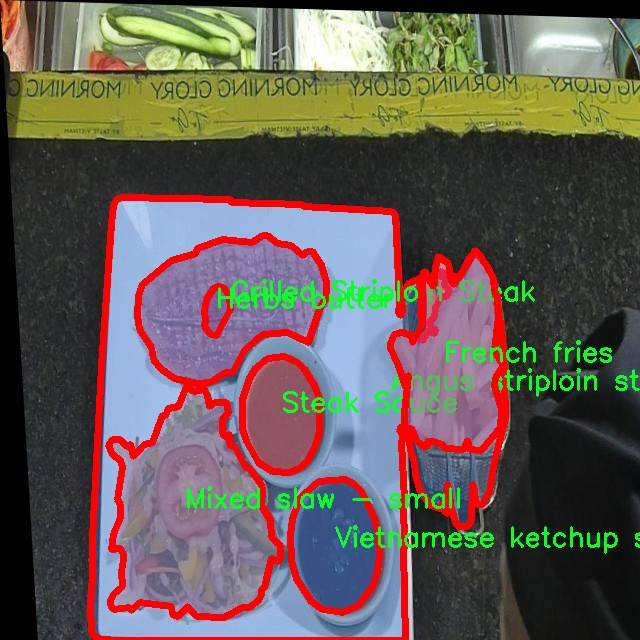
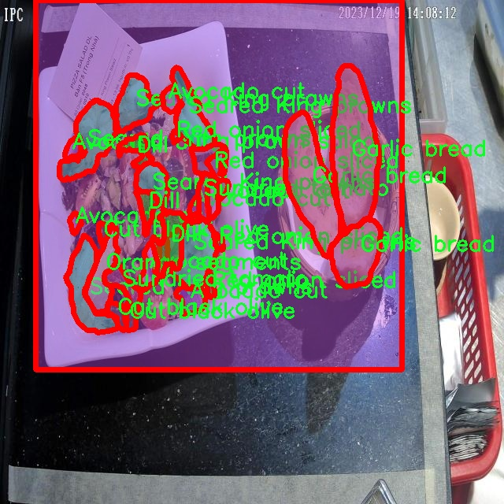
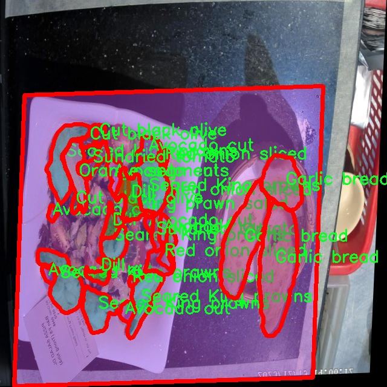
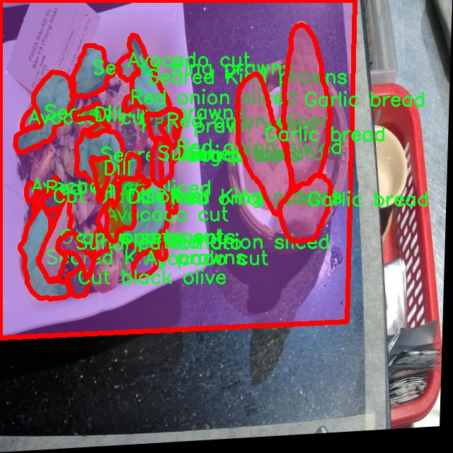

# 美食图像分割系统源码＆数据集分享
 [yolov8-seg-FocalModulation＆yolov8-seg-GFPN等50+全套改进创新点发刊_一键训练教程_Web前端展示]

### 1.研究背景与意义

项目参考[ILSVRC ImageNet Large Scale Visual Recognition Challenge](https://gitee.com/YOLOv8_YOLOv11_Segmentation_Studio/projects)

项目来源[AAAI Global Al lnnovation Contest](https://kdocs.cn/l/cszuIiCKVNis)

研究背景与意义

随着信息技术的迅猛发展，计算机视觉领域的研究逐渐深入，尤其是在图像分割和物体检测方面的应用越来越广泛。美食图像分割作为计算机视觉中的一个重要研究方向，不仅在餐饮行业、食品安全监测、营养分析等领域具有重要的实际应用价值，还为美食文化的传播和推广提供了新的技术手段。YOLO（You Only Look Once）系列模型以其高效的实时检测能力和较高的准确性，成为了图像分割领域的热门选择。特别是YOLOv8的推出，进一步提升了模型在复杂场景下的表现，使其在美食图像分割任务中展现出更为优越的性能。

本研究旨在基于改进的YOLOv8模型，构建一个高效的美食图像分割系统。我们使用的数据集包含3800张图像，涵盖136种不同类别的美食，包括各类主菜、配菜、调料等。这一丰富的类别设置为模型的训练和测试提供了良好的基础，能够有效提升模型对不同美食的识别能力。通过对美食图像的精确分割，不仅可以实现对美食的自动识别，还能够为后续的营养分析、热量计算和个性化推荐等应用提供数据支持。

在当今社会，健康饮食和营养均衡已成为人们日益关注的话题。通过美食图像分割技术，可以帮助用户更好地了解所摄取食物的成分，从而做出更为科学的饮食选择。此外，随着社交媒体的普及，用户对美食分享的需求不断增加，图像分割技术能够提升美食图像的美观度和可读性，从而吸引更多的关注和互动。这对于餐饮企业的品牌推广和市场营销具有重要的意义。

此外，基于YOLOv8的美食图像分割系统的研究，能够为计算机视觉领域提供新的思路和方法。通过对YOLOv8模型的改进，我们可以探索更为高效的特征提取和分割策略，推动深度学习在图像处理中的应用。随着模型的不断优化和数据集的扩展，未来的研究还可以向多模态学习、跨域迁移等方向发展，进一步提升模型的泛化能力和适应性。

综上所述，基于改进YOLOv8的美食图像分割系统的研究，不仅具有重要的理论意义，还具备广泛的应用前景。通过本研究，我们希望能够推动美食图像处理技术的发展，为人们的饮食健康和生活品质提升贡献一份力量。同时，这一研究也将为计算机视觉领域的相关研究提供新的视角和启示，促进学术界与产业界的深度融合。

### 2.图片演示







##### 注意：由于此博客编辑较早，上面“2.图片演示”和“3.视频演示”展示的系统图片或者视频可能为老版本，新版本在老版本的基础上升级如下：（实际效果以升级的新版本为准）

  （1）适配了YOLOV8的“目标检测”模型和“实例分割”模型，通过加载相应的权重（.pt）文件即可自适应加载模型。

  （2）支持“图片识别”、“视频识别”、“摄像头实时识别”三种识别模式。

  （3）支持“图片识别”、“视频识别”、“摄像头实时识别”三种识别结果保存导出，解决手动导出（容易卡顿出现爆内存）存在的问题，识别完自动保存结果并导出到tempDir中。

  （4）支持Web前端系统中的标题、背景图等自定义修改，后面提供修改教程。

  另外本项目提供训练的数据集和训练教程,暂不提供权重文件（best.pt）,需要您按照教程进行训练后实现图片演示和Web前端界面演示的效果。

### 3.视频演示

[3.1 视频演示](https://www.bilibili.com/video/BV1LxmKYTEoP/)

### 4.数据集信息展示

##### 4.1 本项目数据集详细数据（类别数＆类别名）

nc: 136
names: ['A piece of lime', 'Air Dried Striploin Steak - Canadian Lobster', 'Airdried Charcoal Tomahawk', 'American breakfast', 'Anchovies Pizza', 'Anchovies in half', 'Angus striploin steak', 'Asparagus', 'Avo toast - poached egg', 'Avocado cut', 'Bacon', 'Baked Chicken with ham - mozzarella cheese', 'Baked Potato', 'Baked bean', 'Beef Striploin Salad', 'Beetroot', 'Bell pepper sliced', 'Breakfast stack', 'Burrata cheese', 'Canadian Lobster', 'Capers', 'Cargo Pizza', 'Carrot sticks', 'Chargrilled Black Angus beef chunks', 'Chargrilled King Prawns', 'Cherry Tomatoes half cut', 'Chicken Caesar Salad', 'Chicken parmigiana', 'Chopped Tomato and Hoi An Black Pepper Salsa Sauce', 'Chopped parsley', 'Creamy Mushroom Sauce', 'Creamy coconut lime dressing', 'Croutons', 'Cucumber', 'Cut black olive', 'Dill', 'Dip - Nibbles', 'Eggplant sliced', 'Feta cheese', 'Flame-Grilled Salmon Steak in Abalone Sauce', 'Four Cheese Pizza', 'Four Season Pizza', 'French fries', 'Fresh Tomatoes', 'Fried egg', 'Garlic bread', 'Gratin Potatoes', 'Greek Salad', 'Green Lettuce', 'Green bean sticks', 'Green pepper corn', 'Grilled Striploin Steak', 'Grilled Tomato', 'Grilled Vegetables', 'Grilled Vegetables Pizza', 'Grilled chicken', 'Grilled prawns', 'Ham - Mushroom Pizza', 'Hashbrown', 'Hawaii pizza', 'Healthy breakfast', 'Herbs butter', 'Holandaise sauce', 'Hot - Spicy Beef Chunks', 'Hummus Sauce', 'Japaleno chili sliced', 'King prawn salad', 'Lamb Shank', 'Lime butter sauce', 'Margharita pizza', 'Marinated olives', 'Mashed Potatoes', 'Mashed avocado', 'Mexicana pizza', 'Micro mixed herbs', 'Mixed Beansprouts - Chives', 'Mixed Romaine', 'Mixed Salad Side-dish', 'Mixed salad', 'Mixed salad - salad', 'Mixed salad - small', 'Mixed slaw - small', 'Mixed sundried - cherry tomatoes', 'Mozzarella cheese', 'Mushrooms sliced', 'Orange segments', 'Pan Search Salmon Steak', 'Pan Seared Sea Bass', 'Parma ham', 'Pesto Sauce', 'Pineapple sliced', 'Pizza Dough', 'Pizza frutti di mare', 'Pizza tomato sauce', 'Poached eggs', 'Pork sausage', 'Prawn pelled half cut', 'Purple lettuce', 'Red Tuna - Seared Sesame', 'Red baro', 'Red onion sliced', 'Rocket Salad', 'Romaine lettuce', 'Salami napoli sliced', 'Salmon steak - Pan-seared', 'Salsa sauce', 'Sausage', 'Sauteed mushroom', 'Scramble egg', 'Scramble eggs', 'Sea Bass Fish - Pan Seard', 'Seared King prawns', 'Seasame Crusted Red Tuna', 'Shaved Parmesan cheese', 'Shiitake Mushroom', 'Shrimp sliced', 'Silken Tofu', 'Silken Tofu - Mushroom Salads', 'Sliced avocado', 'Sliced grilled Striploin Steak', 'Slow-cooked Lamb shank', 'Sour bread', 'Spinach - blanced', 'Square ham one-fourth sliced', 'Squid sliced', 'Steak Sauce', 'Sundried tomato', 'Surf - Turf', 'Toasted Bread', 'Tomahawk Steak', 'Vietnamese ketchup sauce', 'Wasabi dressing', 'Yellow mustard sauce', 'Yogurt', 'Young basil stem', 'Zucchini sliced']


##### 4.2 本项目数据集信息介绍

数据集信息展示

在构建一个高效的美食图像分割系统的过程中，数据集的选择与构建至关重要。本项目所使用的数据集名为“food”，它包含了丰富多样的美食图像，旨在为改进YOLOv8-seg模型提供坚实的基础。该数据集的类别数量高达136，涵盖了广泛的美食类型，从新鲜的水果到精致的主菜，几乎可以满足所有美食图像分割的需求。

数据集中包含的类别包括但不限于：新鲜的“青柠”，诱人的“加拿大龙虾”，以及各式各样的披萨，如“安康鱼披萨”和“四种奶酪披萨”。此外，经典的美式早餐、意大利的“意式火腿奶酪”以及丰富的沙拉，如“鸡肉凯撒沙拉”和“希腊沙拉”，都在数据集中占有一席之地。这些类别不仅丰富了数据集的多样性，也为模型的训练提供了多种场景和背景，使其能够更好地识别和分割不同类型的美食。

在具体的类别列表中，我们可以看到诸如“烤鸡”、“煎三文鱼”、“法式薯条”等美食，这些图像的多样性为模型提供了充足的训练样本，帮助其学习如何在不同的光照、角度和背景下准确地识别和分割美食。数据集中还包括了多种调味品和配料，如“鳄梨”、“奶酪”、“橄榄油”等，这些元素的存在不仅丰富了图像的内容，也增加了模型在处理复杂场景时的挑战。

为了确保模型的泛化能力，数据集中的图像来源于不同的烹饪风格和文化背景。无论是西式的“汉堡包”还是东南亚的“越南酱油”，都在数据集中得到了体现。这种文化多样性使得模型在处理全球范围内的美食图像时，能够展现出更强的适应性和准确性。

此外，数据集的构建还考虑到了图像的质量和标注的准确性。每一张图像都经过精心挑选和标注，确保了训练数据的高质量。这种高质量的数据不仅有助于提升模型的性能，也为后续的研究和应用提供了可靠的基础。

综上所述，“food”数据集凭借其丰富的类别、多样的美食类型以及高质量的图像，为改进YOLOv8-seg的美食图像分割系统提供了强有力的支持。通过充分利用这一数据集，研究人员和开发者能够在美食图像识别领域取得更大的突破，推动相关技术的进步与应用。











### 5.全套项目环境部署视频教程（零基础手把手教学）

[5.1 环境部署教程链接（零基础手把手教学）](https://www.bilibili.com/video/BV1jG4Ve4E9t/?vd_source=bc9aec86d164b67a7004b996143742dc)


[5.2 安装Python虚拟环境创建和依赖库安装视频教程链接（零基础手把手教学）](https://www.bilibili.com/video/BV1nA4VeYEze/?vd_source=bc9aec86d164b67a7004b996143742dc)

### 6.手把手YOLOV8-seg训练视频教程（零基础小白有手就能学会）

[6.1 手把手YOLOV8-seg训练视频教程（零基础小白有手就能学会）](https://www.bilibili.com/video/BV1cA4VeYETe/?vd_source=bc9aec86d164b67a7004b996143742dc)


按照上面的训练视频教程链接加载项目提供的数据集，运行train.py即可开始训练



     Epoch   gpu_mem       box       obj       cls    labels  img_size
     1/200     0G   0.01576   0.01955  0.007536        22      1280: 100%|██████████| 849/849 [14:42<00:00,  1.04s/it]
               Class     Images     Labels          P          R     mAP@.5 mAP@.5:.95: 100%|██████████| 213/213 [01:14<00:00,  2.87it/s]
                 all       3395      17314      0.994      0.957      0.0957      0.0843

     Epoch   gpu_mem       box       obj       cls    labels  img_size
     2/200     0G   0.01578   0.01923  0.007006        22      1280: 100%|██████████| 849/849 [14:44<00:00,  1.04s/it]
               Class     Images     Labels          P          R     mAP@.5 mAP@.5:.95: 100%|██████████| 213/213 [01:12<00:00,  2.95it/s]
                 all       3395      17314      0.996      0.956      0.0957      0.0845

     Epoch   gpu_mem       box       obj       cls    labels  img_size
     3/200     0G   0.01561    0.0191  0.006895        27      1280: 100%|██████████| 849/849 [10:56<00:00,  1.29it/s]
               Class     Images     Labels          P          R     mAP@.5 mAP@.5:.95: 100%|███████   | 187/213 [00:52<00:00,  4.04it/s]
                 all       3395      17314      0.996      0.957      0.0957      0.0845


### 7.50+种全套YOLOV8-seg创新点代码加载调参视频教程（一键加载写好的改进模型的配置文件）

[7.1 50+种全套YOLOV8-seg创新点代码加载调参视频教程（一键加载写好的改进模型的配置文件）](https://www.bilibili.com/video/BV1Hw4VePEXv/?vd_source=bc9aec86d164b67a7004b996143742dc)

### 8.YOLOV8-seg图像分割算法原理

原始YOLOV8-seg算法原理

YOLOv8-seg算法是YOLO系列中的最新进展，旨在为目标检测和实例分割任务提供高效且准确的解决方案。该算法的设计理念基于YOLO（You Only Look Once）系列的核心思想，即通过单一网络实现快速的实时目标检测，同时扩展到实例分割任务，能够在图像中识别和分割出不同的对象。YOLOv8-seg的结构主要由输入层、主干网络和检测头组成，采用了先进的网络架构和优化策略，以提升模型的性能和效率。

首先，YOLOv8-seg算法的输入层负责接收原始图像数据，并进行必要的预处理，包括缩放、归一化等，以确保输入数据符合网络的要求。接下来，主干网络采用了CSP（Cross Stage Partial）结构，旨在提高特征提取的效率和效果。CSP结构通过将特征提取过程分为多个阶段，使得网络能够在不同层次上捕捉到丰富的特征信息，从而增强模型的表达能力。YOLOv8-seg中引入的C2f模块替代了YOLOv5中的C3模块，这一新模块通过增加残差连接，进一步提升了梯度信息的流动性，使得模型在训练过程中更加稳定，并能够更好地适应不同的输入数据。

在特征融合方面，YOLOv8-seg采用了PAN-FPN（Path Aggregation Network - Feature Pyramid Network）结构，以实现多尺度特征的有效融合。PAN-FPN结构通过在不同层次之间建立连接，能够有效地聚合来自不同尺度的特征信息，从而提升模型对小目标和大目标的检测能力。此外，YOLOv8-seg还引入了BiFPN（Bidirectional Feature Pyramid Network）技术，进一步优化了特征融合过程，使得模型在处理不同尺度特征时更加高效。

检测头是YOLOv8-seg的关键组成部分，其设计采用了解耦合头结构，将分类和回归任务分开处理。这种结构的优势在于能够独立优化分类和定位任务，从而提高整体检测性能。同时，YOLOv8-seg采用了Anchor-Free的检测方式，摒弃了传统的Anchor-Based方法，使得模型在处理不同形状和大小的目标时更加灵活。这一创新使得YOLOv8-seg在实际应用中能够更好地适应复杂场景，减少了对超参数的依赖，提高了模型的通用性。

在训练过程中，YOLOv8-seg引入了动态的Task-Aligned Assigner样本分配策略，以优化训练数据的使用效率。通过智能地分配样本，模型能够更快地收敛，并提高对难以检测目标的识别能力。此外，YOLOv8-seg在数据增强方面进行了创新，采用了关闭马赛克增强的策略，以减少训练过程中的噪声干扰，进一步提升模型的鲁棒性。

损失函数的设计也是YOLOv8-seg的一大亮点。该算法使用了BCELoss（Binary Cross Entropy Loss）作为分类损失，DFLLoss（Distance Focal Loss）和CIoULoss（Complete Intersection over Union Loss）作为回归损失。这种组合损失函数能够有效地处理类别不平衡问题，并提高目标定位的精度，使得模型在复杂场景下的表现更加出色。

总的来说，YOLOv8-seg算法通过引入一系列创新的结构和优化策略，在目标检测和实例分割任务中实现了高效的性能。其主干网络的轻量化设计、特征融合的多样化、检测头的解耦合结构以及智能的训练策略，使得YOLOv8-seg在实时性和准确性之间取得了良好的平衡。这一算法的推出，不仅为计算机视觉领域的研究提供了新的思路，也为实际应用中的目标检测和实例分割任务提供了强有力的工具。随着YOLOv8-seg的不断发展和优化，未来有望在更多的应用场景中发挥重要作用，推动智能视觉技术的进一步进步。


### 9.系统功能展示（检测对象为举例，实际内容以本项目数据集为准）

图9.1.系统支持检测结果表格显示

  图9.2.系统支持置信度和IOU阈值手动调节

  图9.3.系统支持自定义加载权重文件best.pt(需要你通过步骤5中训练获得)

  图9.4.系统支持摄像头实时识别

  图9.5.系统支持图片识别

  图9.6.系统支持视频识别

  图9.7.系统支持识别结果文件自动保存

  图9.8.系统支持Excel导出检测结果数据


### 10.50+种全套YOLOV8-seg创新点原理讲解（非科班也可以轻松写刊发刊，V11版本正在科研待更新）

#### 10.1 由于篇幅限制，每个创新点的具体原理讲解就不一一展开，具体见下列网址中的创新点对应子项目的技术原理博客网址【Blog】：


[10.1 50+种全套YOLOV8-seg创新点原理讲解链接](https://gitee.com/qunmasj/good)

#### 10.2 部分改进模块原理讲解(完整的改进原理见上图和技术博客链接)【如果此小节的图加载失败可以通过CSDN或者Github搜索该博客的标题访问原始博客，原始博客图片显示正常】
### YOLOv8简介
YOLOv8目标检测算法继承了YOLOv1 系列的思考,是一种新型端到端的目标检测算法,尽管现在原始检测算法已经开源,但是鲜有发表的相关论文.YOLOv8的网络结构如图1[1所示,主要可分为Input输入端、Backbone 骨干神经网络、Neck混合特征网络层和 Head预测层网络共4个部分.

输入端( input)方法包含的功能模块有:马赛克( mosaic)数据增强、自适应锚框( anchor)计算、自适应图片缩放和 Mixup 数据增强['6].马赛克数据增强包括3种方式:缩放,色彩空间调整和马赛克增强.
该方法通过将4张图像进行随机的缩放﹑裁剪和打乱分布方式等操作来重新拼接图像,可丰富检测的数据集,具体步骤可见图2.随机缩放增加的许多小目标,非常适于解决卫星数据往往因距离目标过远从而导致图像中几乎都是小目标这一问题.在自适应锚框计算中, YOLO算法在每次训练数据之前,都会根据标注信息自动计算该数据集最合适的锚框尺寸,然后自动匹配最佳锚框.而自适应图片缩放只在检测时使用,由于不同场景需求不同,因而基于缩放系数YOLOv8提供了多尺度的不同大小模型.Mixup 数据增强鼓励模型对训练样本有一个线性的理解,具体做法是在目标检测中将两幅图像的像素值按照图像透明度的通道信息( alpha值)进行线性融合,对于标签box的处理直接采用拼接( con-cat)的方法拼接到一起.


Backbone骨干网络指用来提取图像特征的网络,整体结构包括注意力机制( focus)模块、跨阶段局部网络[ 7] ( cross stage partial network , CSP)和空间金字塔池化结构( spatial pyramid pooling,SPP).其中, Focus模块的作用是在图片进入 Backbone骨干网络前,对图片进行切片操作,即在一张图片中每隔一个像素取一个值,获得4张互补的图片,最后将新生成的图片经过卷积操作,得到没有信息丢失的2倍下采样特征图.YOLOv8使用了CSPNet 中的C2f网络,网络见图3,其中 CBS 就是卷积层,而瓶颈层( bottleneck layer)使用的是1* 1的卷积神经网络.C2f网络在保证轻量化的同时获得更加丰富的梯度流信息.而SPP结构是空间金字塔池化,能将任意大小的特征图转换成固定大小的特征向量,即把输入的特征地图划分为多个尺度,然后对每个图进行最大池化,再将提取的特征值拼接起来成为一维向量,输入SPP层获取分类.


Neck 结构如图4所示,它是由卷积层和C2f模块组成的的网络层,采用了路径聚合网络( path ag-gregation network ,PAN)和特征金字塔网络( featurepyramid networks , FPN)的结构对特征进行多尺度融合,目标是将图像特征传递到预测层.其中 PAN结构指图4左半边,它自底向上进行下采样,使顶层特征包含图像位置信息,两个特征最后进行融合,使不同尺寸的特征图都包含图像语义信息和图像特征信息，保证了网络对不同尺寸的图片的准确预测.而FPN结构指图4右半边,指通过自顶向下进行上采样,将高层特征与底层特征进行融合,从而同时利用低层特征的高分辨率和高层特征的丰富语义信息,并进行了多尺度特征的独立预测,对小物体的检测效果有明显的提升.从 FPN模块的基础上看,它增加了自底向上的特征金字塔结构,保留了更多的浅层位置特征,将整体特征提取能力进一步提升.


Head的结构如图5所示,在该结构中 YOLOv8采用了解耦检测头( decoupled-head )[ 18],因为分类和定位的关注点不同,分类更关注目标的纹理内容而定位更关注目标的边缘信息.因而解耦头结构考虑到分类和定位所关注的内容的不同,采用不同的分支来进行运算,提升了检测效果,相对应的回归头的通道数也改变了.


### MS-Block简介
实时目标检测，以YOLO系列为例，已在工业领域中找到重要应用，特别是在边缘设备（如无人机和机器人）中。与之前的目标检测器不同，实时目标检测器旨在在速度和准确性之间追求最佳平衡。为了实现这一目标，提出了大量的工作：从第一代DarkNet到CSPNet，再到最近的扩展ELAN，随着性能的快速增长，实时目标检测器的架构经历了巨大的变化。

尽管性能令人印象深刻，但在不同尺度上识别对象仍然是实时目标检测器面临的基本挑战。这促使作者设计了一个强大的编码器架构，用于学习具有表现力的多尺度特征表示。具体而言，作者从两个新的角度考虑为实时目标检测编码多尺度特征：

从局部视角出发，作者设计了一个具有简单而有效的分层特征融合策略的MS-Block。受到Res2Net的启发，作者在MS-Block中引入了多个分支来进行特征提取，但不同的是，作者使用了一个带有深度卷积的 Inverted Bottleneck Block块，以实现对大Kernel的高效利用。

从全局视角出发，作者提出随着网络加深逐渐增加卷积的Kernel-Size。作者在浅层使用小Kernel卷积来更高效地处理高分辨率特征。另一方面，在深层中，作者采用大Kernel卷积来捕捉广泛的信息。

基于以上设计原则，作者呈现了作者的实时目标检测器，称为YOLO-MS。为了评估作者的YOLO-MS的性能，作者在MS COCO数据集上进行了全面的实验。还提供了与其他最先进方法的定量比较，以展示作者方法的强大性能。如图1所示，YOLO-MS在计算性能平衡方面优于其他近期的实时目标检测器。


具体而言，YOLO-MS-XS在MS COCO上获得了43%+的AP得分，仅具有450万个可学习参数和8.7亿个FLOPs。YOLO-MS-S和YOLO-MS分别获得了46%+和51%+的AP，可学习参数分别为810万和2220万。此外，作者的工作还可以作为其他YOLO模型的即插即用模块。通常情况下，作者的方法可以将YOLOv8的AP从37%+显著提高到40%+，甚至还可以使用更少的参数和FLOPs。

CSP Block是一个基于阶段级梯度路径的网络，平衡了梯度组合和计算成本。它是广泛应用于YOLO系列的基本构建块。已经提出了几种变体，包括YOLOv4和YOLOv5中的原始版本，Scaled YOLOv4中的CSPVoVNet，YOLOv7中的ELAN，以及RTMDet中提出的大Kernel单元。作者在图2(a)和图2(b)中分别展示了原始CSP块和ELAN的结构。


上述实时检测器中被忽视的一个关键方面是如何在基本构建块中编码多尺度特征。其中一个强大的设计原则是Res2Net，它聚合了来自不同层次的特征以增强多尺度表示。然而，这一原则并没有充分探索大Kernel卷积的作用，而大Kernel卷积已经在基于CNN的视觉识别任务模型中证明有效。将大Kernel卷积纳入Res2Net的主要障碍在于它们引入的计算开销，因为构建块采用了标准卷积。在作者的方法中，作者提出用 Inverted Bottleneck Block替代标准的3 × 3卷积，以享受大Kernel卷积的好处。

#### MS-Block

基于前面的分析，参考该博客提出了一个带有分层特征融合策略的全新Block，称为MS-Block，以增强实时目标检测器在提取多尺度特征时的能力，同时保持快速的推理速度。

MS-Block的具体结构如图2(c)所示。假设是输入特征。通过1×1卷积的转换后，X的通道维度增加到n*C。然后，作者将X分割成n个不同的组，表示为，其中。为了降低计算成本，作者选择n为3。

注意，除了之外，每个其他组都经过一个 Inverted Bottleneck Block层，用表示，其中k表示Kernel-Size，以获得。的数学表示如下：


根据这个公式，作者不将 Inverted Bottleneck Block层连接到，使其作为跨阶段连接，并保留来自前面层的信息。最后，作者将所有分割连接在一起，并应用1×1卷积来在所有分割之间进行交互，每个分割都编码不同尺度的特征。当网络加深时，这个1×1卷积也用于调整通道数。

#### Heterogeneous Kernel Selection Protocol
除了构建块的设计外，作者还从宏观角度探讨了卷积的使用。之前的实时目标检测器在不同的编码器阶段采用了同质卷积（即具有相同Kernel-Size的卷积），但作者认为这不是提取多尺度语义信息的最佳选项。

在金字塔结构中，从检测器的浅阶段提取的高分辨率特征通常用于捕捉细粒度语义，将用于检测小目标。相反，来自网络较深阶段的低分辨率特征用于捕捉高级语义，将用于检测大目标。如果作者在所有阶段都采用统一的小Kernel卷积，深阶段的有效感受野（ERF）将受到限制，影响大目标的性能。在每个阶段中引入大Kernel卷积可以帮助解决这个问题。然而，具有大的ERF的大Kernel可以编码更广泛的区域，这增加了在小目标外部包含噪声信息的概率，并且降低了推理速度。

在这项工作中，作者建议在不同阶段中采用异构卷积，以帮助捕获更丰富的多尺度特征。具体来说，在编码器的第一个阶段中，作者采用最小Kernel卷积，而最大Kernel卷积位于最后一个阶段。随后，作者逐步增加中间阶段的Kernel-Size，使其与特征分辨率的增加保持一致。这种策略允许提取细粒度和粗粒度的语义信息，增强了编码器的多尺度特征表示能力。

正如图所示，作者将k的值分别分配给编码器中的浅阶段到深阶段，取值为3、5、7和9。作者将其称为异构Kernel选择（HKS）协议。


作者的HKS协议能够在深层中扩大感受野，而不会对浅层产生任何其他影响。第4节的图4支持了作者的分析。此外，HKS不仅有助于编码更丰富的多尺度特征，还确保了高效的推理。

如表1所示，将大Kernel卷积应用于高分辨率特征会产生较高的计算开销。然而，作者的HKS协议在低分辨率特征上采用大Kernel卷积，从而与仅使用大Kernel卷积相比，大大降低了计算成本。


在实践中，作者经验性地发现，采用HKS协议的YOLO-MS的推理速度几乎与仅使用深度可分离的3 × 3卷积相同。


如图所示，作者模型的Backbone由4个阶段组成，每个阶段后面跟随1个步长为2的3 × 3卷积进行下采样。在第3个阶段后，作者添加了1个SPP块，与RTMDet中一样。在作者的编码器上，作者使用PAFPN作为Neck来构建特征金字塔[31, 35]。它融合了从Backbone不同阶段提取的多尺度特征。Neck中使用的基本构建块也是作者的MS-Block，在其中使用3 × 3深度可分离卷积进行快速推理。

此外，为了在速度和准确性之间取得更好的平衡，作者将Backbone中多级特征的通道深度减半。作者提供了3个不同尺度的YOLO-MS变体，即YOLO-MS-XS、YOLO-MS-S和YOLO-MS。不同尺度的YOLO-MS的详细配置列在表2中。对于YOLO-MS的其他部分，作者将其保持与RTMDet相同。


### 11.项目核心源码讲解（再也不用担心看不懂代码逻辑）

#### 11.1 ui.py

以下是经过简化和注释的核心代码部分：

```python
import sys
import subprocess
from QtFusion.path import abs_path

def run_script(script_path):
    """
    使用当前 Python 环境运行指定的脚本。

    Args:
        script_path (str): 要运行的脚本路径
    """
    # 获取当前 Python 解释器的路径
    python_path = sys.executable

    # 构建运行命令，使用 streamlit 运行指定的脚本
    command = f'"{python_path}" -m streamlit run "{script_path}"'

    # 执行命令并等待其完成
    result = subprocess.run(command, shell=True)
    
    # 检查命令执行的返回码，非零表示出错
    if result.returncode != 0:
        print("脚本运行出错。")

# 主程序入口
if __name__ == "__main__":
    # 获取脚本的绝对路径
    script_path = abs_path("web.py")

    # 运行指定的脚本
    run_script(script_path)
```

### 代码分析与注释：

1. **导入模块**：
   - `sys`：用于访问与 Python 解释器相关的变量和函数。
   - `subprocess`：用于创建新进程、连接到它们的输入/输出/错误管道，并获取返回码。
   - `abs_path`：从 `QtFusion.path` 模块导入的函数，用于获取文件的绝对路径。

2. **`run_script` 函数**：
   - 功能：运行指定路径的 Python 脚本。
   - 参数：`script_path`，要运行的脚本的路径。
   - 获取当前 Python 解释器的路径，构建运行命令，并通过 `subprocess.run` 执行该命令。
   - 检查命令的返回码，若非零则输出错误信息。

3. **主程序入口**：
   - 使用 `if __name__ == "__main__":` 确保只有在直接运行该脚本时才会执行以下代码。
   - 调用 `abs_path` 获取 `web.py` 的绝对路径，并将其传递给 `run_script` 函数以执行。

这个简化后的代码保留了核心功能，并添加了详细的中文注释，以便于理解每个部分的作用。

这个文件是一个 Python 脚本，主要用于运行一个名为 `web.py` 的 Streamlit 应用。首先，脚本导入了必要的模块，包括 `sys`、`os` 和 `subprocess`，这些模块分别用于处理系统参数、文件路径和执行外部命令。

在脚本中定义了一个名为 `run_script` 的函数，该函数接受一个参数 `script_path`，表示要运行的脚本的路径。函数的主要功能是使用当前的 Python 环境来执行指定的脚本。具体实现中，首先通过 `sys.executable` 获取当前 Python 解释器的路径，然后构建一个命令字符串，使用 `streamlit run` 命令来运行指定的脚本。接着，使用 `subprocess.run` 方法执行这个命令，并通过 `shell=True` 参数允许在 shell 中执行命令。

在执行命令后，函数会检查返回的状态码。如果状态码不为零，表示脚本运行过程中出现了错误，程序会打印出“脚本运行出错。”的提示信息。

在脚本的最后部分，使用 `if __name__ == "__main__":` 来确保只有在直接运行该脚本时才会执行以下代码。这里指定了要运行的脚本路径，即 `web.py`，并调用 `run_script` 函数来执行它。为了确保路径的正确性，使用了 `abs_path` 函数来获取 `web.py` 的绝对路径。

总体来说，这个脚本的主要功能是简化运行 Streamlit 应用的过程，通过封装在 `run_script` 函数中，使得用户只需指定脚本路径，就可以方便地启动应用。

#### 11.2 demo_test_camera.py

以下是代码中最核心的部分，并附上详细的中文注释：

```python
import cv2
import numpy as np
from PIL import ImageFont, ImageDraw, Image
from hashlib import md5
from model import Web_Detector
from chinese_name_list import Label_list

def generate_color_based_on_name(name):
    # 使用哈希函数生成稳定的颜色
    hash_object = md5(name.encode())  # 对名字进行MD5哈希
    hex_color = hash_object.hexdigest()[:6]  # 取前6位16进制数作为颜色
    r, g, b = int(hex_color[0:2], 16), int(hex_color[2:4], 16), int(hex_color[4:6], 16)  # 转换为RGB值
    return (b, g, r)  # OpenCV 使用BGR格式

def draw_with_chinese(image, text, position, font_size=20, color=(255, 0, 0)):
    # 在图像上绘制中文文本
    image_pil = Image.fromarray(cv2.cvtColor(image, cv2.COLOR_BGR2RGB))  # 转换为PIL格式
    draw = ImageDraw.Draw(image_pil)  # 创建绘图对象
    font = ImageFont.truetype("simsun.ttc", font_size, encoding="unic")  # 加载中文字体
    draw.text(position, text, font=font, fill=color)  # 绘制文本
    return cv2.cvtColor(np.array(image_pil), cv2.COLOR_RGB2BGR)  # 转换回OpenCV格式

def draw_detections(image, info):
    # 绘制检测结果，包括边框、类别名称等
    name, bbox = info['class_name'], info['bbox']  # 获取类别名称和边框
    x1, y1, x2, y2 = bbox  # 解包边框坐标
    cv2.rectangle(image, (x1, y1), (x2, y2), color=(0, 0, 255), thickness=3)  # 绘制边框
    image = draw_with_chinese(image, name, (x1, y1 - 10), font_size=20)  # 绘制类别名称
    return image

def process_frame(model, image):
    # 处理每一帧图像
    pre_img = model.preprocess(image)  # 预处理图像
    pred = model.predict(pre_img)  # 进行预测
    det = pred[0]  # 获取检测结果

    if det is not None and len(det):
        det_info = model.postprocess(pred)  # 后处理，获取检测信息
        for info in det_info:
            image = draw_detections(image, info)  # 绘制检测结果
    return image

if __name__ == "__main__":
    model = Web_Detector()  # 初始化检测模型
    model.load_model("./weights/yolov8s-seg.pt")  # 加载模型权重

    # 摄像头实时处理
    cap = cv2.VideoCapture(0)  # 打开摄像头
    while cap.isOpened():
        ret, frame = cap.read()  # 读取摄像头帧
        if not ret:
            break
        processed_frame = process_frame(model, frame)  # 处理帧
        cv2.imshow('Camera Feed', processed_frame)  # 显示处理后的帧
        if cv2.waitKey(1) & 0xFF == ord('q'):  # 按'q'退出
            break
    cap.release()  # 释放摄像头
    cv2.destroyAllWindows()  # 关闭所有OpenCV窗口
```

### 代码说明：
1. **生成颜色**：`generate_color_based_on_name` 函数使用 MD5 哈希生成与名字对应的颜色，以确保相同的名字总是生成相同的颜色。
2. **绘制中文文本**：`draw_with_chinese` 函数在图像上绘制中文文本，使用了 PIL 库来处理中文字体。
3. **绘制检测结果**：`draw_detections` 函数负责在图像上绘制检测到的物体的边框和类别名称。
4. **处理每一帧**：`process_frame` 函数对每一帧图像进行预处理、预测和后处理，最终返回绘制了检测结果的图像。
5. **主程序**：在 `__main__` 中，初始化模型并打开摄像头，实时处理视频流，直到用户按下 'q' 键退出。

这个程序文件 `demo_test_camera.py` 是一个用于实时目标检测和分割的应用，主要依赖于 OpenCV 和深度学习模型。程序的核心功能是通过摄像头捕捉视频流，并对每一帧进行处理，识别出图像中的目标，并在图像上绘制相应的检测框、类别名称以及一些统计信息。

首先，程序导入了一些必要的库，包括 `random`、`cv2`（OpenCV）、`numpy`、`PIL`（用于处理图像字体和绘制）以及 `hashlib`（用于生成颜色的哈希值）。同时，还导入了自定义的 `Web_Detector` 模型和中文名称列表 `Label_list`。

程序中定义了几个辅助函数。`generate_color_based_on_name` 函数使用 MD5 哈希算法根据目标名称生成一个稳定的颜色值，以便在绘制时使用。`calculate_polygon_area` 函数用于计算多边形的面积。`draw_with_chinese` 函数则是将中文文本绘制到图像上，使用了指定的字体和颜色。

`adjust_parameter` 函数根据图像的大小调整绘制参数，以确保在不同分辨率下的绘制效果一致。`draw_detections` 函数是程序的核心部分之一，它负责在图像上绘制检测到的目标，包括边界框、类别名称、面积、周长、圆度和颜色值等信息。该函数会根据是否存在掩膜（mask）来决定绘制的方式，如果存在掩膜，则会填充多边形并计算相关的几何特征。

`process_frame` 函数用于处理每一帧图像，首先对图像进行预处理，然后使用模型进行预测，最后将检测到的信息传递给 `draw_detections` 函数进行绘制。

在主程序部分，首先加载模型并初始化摄像头。程序进入一个循环，不断读取摄像头的帧，调用 `process_frame` 函数处理每一帧，并使用 OpenCV 的 `imshow` 函数显示处理后的图像。如果用户按下 'q' 键，程序将退出循环，释放摄像头资源并关闭所有窗口。

总体来说，这个程序实现了一个实时的目标检测和分割系统，能够在视频流中识别目标并提供丰富的视觉反馈。

#### 11.3 ultralytics\models\fastsam\model.py

```python
# Ultralytics YOLO 🚀, AGPL-3.0 license

from pathlib import Path  # 导入Path类，用于处理文件路径
from ultralytics.engine.model import Model  # 从ultralytics库中导入Model类

from .predict import FastSAMPredictor  # 导入FastSAMPredictor类，用于快速预测
from .val import FastSAMValidator  # 导入FastSAMValidator类，用于快速验证


class FastSAM(Model):
    """
    FastSAM模型接口。

    示例：
        ```python
        from ultralytics import FastSAM

        model = FastSAM('last.pt')  # 加载模型
        results = model.predict('ultralytics/assets/bus.jpg')  # 进行预测
        ```
    """

    def __init__(self, model='FastSAM-x.pt'):
        """初始化FastSAM类，调用父类Model的初始化方法，并设置默认模型。"""
        # 如果传入的模型名称是'FastSAM.pt'，则将其更改为'FastSAM-x.pt'
        if str(model) == 'FastSAM.pt':
            model = 'FastSAM-x.pt'
        # 确保模型文件后缀不是.yaml或.yml，因为FastSAM只支持预训练模型
        assert Path(model).suffix not in ('.yaml', '.yml'), 'FastSAM models only support pre-trained models.'
        # 调用父类的初始化方法，设置模型和任务类型为'segment'
        super().__init__(model=model, task='segment')

    @property
    def task_map(self):
        """返回一个字典，将分割任务映射到相应的预测器和验证器类。"""
        return {'segment': {'predictor': FastSAMPredictor, 'validator': FastSAMValidator}}
```

### 代码核心部分说明：
1. **类定义**：`FastSAM`类继承自`Model`类，作为FastSAM模型的接口。
2. **初始化方法**：在`__init__`方法中，设置默认模型，并确保模型文件格式正确。
3. **任务映射**：`task_map`属性返回一个字典，映射分割任务到相应的预测器和验证器类，便于后续调用。

这个程序文件定义了一个名为 `FastSAM` 的类，它是 Ultralytics YOLO 框架中的一个模型接口，主要用于图像分割任务。文件开头的注释表明该项目遵循 AGPL-3.0 许可证，并引入了一些必要的模块。

在 `FastSAM` 类的定义中，首先是一个文档字符串，提供了该类的使用示例。用户可以通过导入 `FastSAM` 类并创建一个模型实例，传入预训练模型的路径，然后调用 `predict` 方法进行图像预测。

构造函数 `__init__` 接受一个参数 `model`，默认值为 `'FastSAM-x.pt'`。在构造函数中，如果传入的模型名称是 `'FastSAM.pt'`，则将其更改为 `'FastSAM-x.pt'`。接着，程序会检查传入的模型文件后缀，确保它不是 YAML 格式，因为 `FastSAM` 模型只支持预训练模型。最后，调用父类 `Model` 的构造函数，传入模型路径和任务类型（这里是 'segment'）。

此外，`FastSAM` 类还定义了一个属性 `task_map`，它返回一个字典，映射了分割任务到相应的预测器和验证器类。这个字典包含了任务类型 'segment'，对应的预测器是 `FastSAMPredictor`，验证器是 `FastSAMValidator`。这个映射关系使得在执行图像分割时，可以方便地找到相应的处理类。

总的来说，这个文件提供了一个结构清晰的接口，使得用户能够方便地使用 FastSAM 模型进行图像分割任务。

#### 11.4 ultralytics\models\yolo\pose\train.py

以下是代码中最核心的部分，并附上详细的中文注释：

```python
# 导入必要的库和模块
from copy import copy
from ultralytics.models import yolo
from ultralytics.nn.tasks import PoseModel
from ultralytics.utils import DEFAULT_CFG, LOGGER
from ultralytics.utils.plotting import plot_images, plot_results

class PoseTrainer(yolo.detect.DetectionTrainer):
    """
    PoseTrainer类扩展了DetectionTrainer类，用于基于姿态模型的训练。
    """

    def __init__(self, cfg=DEFAULT_CFG, overrides=None, _callbacks=None):
        """初始化PoseTrainer对象，指定配置和覆盖参数。"""
        if overrides is None:
            overrides = {}
        overrides['task'] = 'pose'  # 设置任务类型为姿态估计
        super().__init__(cfg, overrides, _callbacks)  # 调用父类构造函数

        # 针对Apple MPS设备的已知问题发出警告
        if isinstance(self.args.device, str) and self.args.device.lower() == 'mps':
            LOGGER.warning("WARNING ⚠️ Apple MPS known Pose bug. Recommend 'device=cpu' for Pose models. "
                           'See https://github.com/ultralytics/ultralytics/issues/4031.')

    def get_model(self, cfg=None, weights=None, verbose=True):
        """获取指定配置和权重的姿态估计模型。"""
        # 创建PoseModel实例
        model = PoseModel(cfg, ch=3, nc=self.data['nc'], data_kpt_shape=self.data['kpt_shape'], verbose=verbose)
        if weights:
            model.load(weights)  # 加载权重

        return model  # 返回模型

    def set_model_attributes(self):
        """设置PoseModel的关键点形状属性。"""
        super().set_model_attributes()  # 调用父类方法
        self.model.kpt_shape = self.data['kpt_shape']  # 设置关键点形状

    def get_validator(self):
        """返回PoseValidator类的实例，用于验证。"""
        self.loss_names = 'box_loss', 'pose_loss', 'kobj_loss', 'cls_loss', 'dfl_loss'  # 定义损失名称
        return yolo.pose.PoseValidator(self.test_loader, save_dir=self.save_dir, args=copy(self.args))  # 返回验证器实例

    def plot_training_samples(self, batch, ni):
        """绘制一批训练样本，包括类标签、边界框和关键点的注释。"""
        images = batch['img']  # 获取图像
        kpts = batch['keypoints']  # 获取关键点
        cls = batch['cls'].squeeze(-1)  # 获取类标签
        bboxes = batch['bboxes']  # 获取边界框
        paths = batch['im_file']  # 获取图像文件路径
        batch_idx = batch['batch_idx']  # 获取批次索引
        
        # 绘制图像并保存
        plot_images(images,
                    batch_idx,
                    cls,
                    bboxes,
                    kpts=kpts,
                    paths=paths,
                    fname=self.save_dir / f'train_batch{ni}.jpg',
                    on_plot=self.on_plot)

    def plot_metrics(self):
        """绘制训练和验证的指标。"""
        plot_results(file=self.csv, pose=True, on_plot=self.on_plot)  # 保存结果图像
```

### 代码核心部分说明：
1. **PoseTrainer类**：该类继承自`DetectionTrainer`，用于实现姿态估计模型的训练。
2. **初始化方法**：设置任务类型为姿态估计，并处理特定设备的警告。
3. **获取模型**：创建并返回一个姿态估计模型，支持加载预训练权重。
4. **设置模型属性**：设置模型的关键点形状属性。
5. **获取验证器**：返回用于验证的PoseValidator实例，并定义损失名称。
6. **绘制训练样本**：将训练样本的图像、关键点和边界框绘制并保存为图像文件。
7. **绘制指标**：绘制训练和验证过程中的指标图像。

这个程序文件是一个用于训练姿态估计模型的类，名为 `PoseTrainer`，它继承自 `yolo.detect.DetectionTrainer`。文件中首先导入了一些必要的模块和类，包括 `PoseModel`、日志记录器 `LOGGER` 以及用于绘图的函数。

在 `PoseTrainer` 类的构造函数 `__init__` 中，初始化了训练器的配置和参数。如果没有提供覆盖参数，则会使用默认值。这里特别注意到，如果设备设置为 'mps'（即 Apple 的 Metal Performance Shaders），则会发出警告，建议使用 'cpu' 设备进行姿态模型的训练，以避免已知的 bug。

`get_model` 方法用于获取姿态估计模型，接受配置和权重参数。如果提供了权重，则会加载这些权重。该方法返回一个 `PoseModel` 实例，模型的输入通道数为 3，类别数和关键点形状则来自数据集配置。

`set_model_attributes` 方法用于设置模型的关键点形状属性，确保模型能够正确处理输入数据的关键点信息。

`get_validator` 方法返回一个 `PoseValidator` 实例，用于验证模型的性能。它会设置损失名称，包括边界框损失、姿态损失、关键点对象损失、类别损失和分布损失。

`plot_training_samples` 方法用于绘制一批训练样本，包括带有注释的类别标签、边界框和关键点。它接收一个批次的数据，并使用 `plot_images` 函数将这些信息可视化，保存为图像文件。

最后，`plot_metrics` 方法用于绘制训练和验证过程中的指标，通过调用 `plot_results` 函数生成结果图像，并保存到指定的文件中。

整体来看，这个文件实现了一个姿态估计模型的训练框架，包含了模型的初始化、训练、验证和可视化等功能，便于用户进行姿态识别任务的训练和分析。

#### 11.5 train.py

以下是经过简化和注释的核心代码部分：

```python
import os
import torch
import yaml
from ultralytics import YOLO  # 导入YOLO模型库

if __name__ == '__main__':  # 确保该模块被直接运行时才执行以下代码
    # 设置训练参数
    workers = 1  # 数据加载的工作进程数
    batch = 8  # 每个批次的样本数量
    device = "0" if torch.cuda.is_available() else "cpu"  # 检查是否有可用的GPU

    # 获取数据集配置文件的绝对路径
    data_path = abs_path(f'datasets/data/data.yaml', path_type='current')

    # 读取YAML文件，保持原有顺序
    with open(data_path, 'r') as file:
        data = yaml.load(file, Loader=yaml.FullLoader)

    # 修改数据集路径
    if 'train' in data and 'val' in data and 'test' in data:
        directory_path = os.path.dirname(data_path.replace(os.sep, '/'))  # 获取目录路径
        data['train'] = directory_path + '/train'  # 更新训练集路径
        data['val'] = directory_path + '/val'      # 更新验证集路径
        data['test'] = directory_path + '/test'    # 更新测试集路径

        # 将修改后的数据写回YAML文件
        with open(data_path, 'w') as file:
            yaml.safe_dump(data, file, sort_keys=False)

    # 加载YOLO模型配置和预训练权重
    model = YOLO(r"C:\codeseg\codenew\50+种YOLOv8算法改进源码大全和调试加载训练教程（非必要）\改进YOLOv8模型配置文件\yolov8-seg-C2f-Faster.yaml").load("./weights/yolov8s-seg.pt")

    # 开始训练模型
    results = model.train(
        data=data_path,  # 指定训练数据的配置文件路径
        device=device,  # 使用的设备（GPU或CPU）
        workers=workers,  # 数据加载的工作进程数
        imgsz=640,  # 输入图像的大小
        epochs=100,  # 训练的轮数
        batch=batch,  # 每个批次的样本数量
    )
```

### 代码注释说明：
1. **导入必要的库**：引入操作系统、PyTorch、YAML解析库和YOLO模型库。
2. **主程序入口**：确保只有在直接运行该脚本时才执行后续代码。
3. **设置训练参数**：
   - `workers`：设置数据加载的工作进程数。
   - `batch`：设置每个批次的样本数量。
   - `device`：检查是否有可用的GPU，如果没有则使用CPU。
4. **读取数据集配置文件**：获取数据集的YAML文件路径并读取内容。
5. **修改数据集路径**：根据当前目录更新训练、验证和测试集的路径，并将其写回YAML文件。
6. **加载YOLO模型**：指定模型配置文件和预训练权重。
7. **开始训练模型**：调用模型的训练方法，传入数据路径、设备、工作进程数、图像大小、训练轮数和批次大小等参数。

该程序文件 `train.py` 是一个用于训练 YOLO 模型的 Python 脚本。首先，它导入了必要的库，包括 `os`、`torch`、`yaml` 和 `ultralytics` 中的 YOLO 模型。此外，还设置了 Matplotlib 的后端为 TkAgg，以便于图形界面的显示。

在主程序部分，首先定义了一些训练参数，包括工作进程数 `workers` 和批次大小 `batch`。批次大小可以根据计算机的显存和内存进行调整，以避免显存溢出。接着，程序检查是否有可用的 GPU，如果有，则将设备设置为 "0"（即使用第一个 GPU），否则使用 CPU。

接下来，程序通过 `abs_path` 函数获取数据集配置文件 `data.yaml` 的绝对路径，并将其转换为 Unix 风格的路径。然后，它获取该路径的目录，以便后续修改数据集路径。

程序打开 YAML 文件并读取内容，使用 `yaml.load` 函数保持原有顺序。若 YAML 文件中包含 `train`、`val` 和 `test` 三个键，程序将这些键的值修改为对应的训练、验证和测试数据集的路径，并将修改后的内容写回 YAML 文件。

在模型加载部分，程序使用 YOLO 模型的配置文件加载一个预训练的模型。这里的配置文件路径是一个具体的本地路径，用户可以根据需要替换为其他模型的配置文件。

最后，程序调用 `model.train` 方法开始训练模型，指定了训练数据的配置文件路径、设备、工作进程数、输入图像大小、训练的 epoch 数量和批次大小等参数。通过这些设置，程序将开始进行模型的训练过程。

#### 11.6 ultralytics\trackers\utils\matching.py

以下是经过简化和注释的核心代码部分：

```python
import numpy as np
import scipy
from scipy.spatial.distance import cdist
from ultralytics.utils.metrics import bbox_ioa

try:
    import lap  # 导入线性分配库
    assert lap.__version__  # 确保导入的库版本有效
except (ImportError, AssertionError, AttributeError):
    from ultralytics.utils.checks import check_requirements
    check_requirements('lapx>=0.5.2')  # 检查并安装lapx库
    import lap

def linear_assignment(cost_matrix, thresh, use_lap=True):
    """
    使用线性分配算法进行匹配。

    参数:
        cost_matrix (np.ndarray): 成本矩阵，包含分配的成本值。
        thresh (float): 认为分配有效的阈值。
        use_lap (bool, optional): 是否使用lap.lapjv算法。默认为True。

    返回:
        (tuple): 包含匹配索引、未匹配的索引（来自'a'）和未匹配的索引（来自'b'）的元组。
    """
    if cost_matrix.size == 0:
        # 如果成本矩阵为空，返回空匹配和所有未匹配索引
        return np.empty((0, 2), dtype=int), tuple(range(cost_matrix.shape[0])), tuple(range(cost_matrix.shape[1]))

    if use_lap:
        # 使用lap库进行线性分配
        _, x, y = lap.lapjv(cost_matrix, extend_cost=True, cost_limit=thresh)
        matches = [[ix, mx] for ix, mx in enumerate(x) if mx >= 0]  # 找到匹配对
        unmatched_a = np.where(x < 0)[0]  # 找到未匹配的'a'索引
        unmatched_b = np.where(y < 0)[0]  # 找到未匹配的'b'索引
    else:
        # 使用scipy库进行线性分配
        x, y = scipy.optimize.linear_sum_assignment(cost_matrix)  # 获取匹配的行和列索引
        matches = np.asarray([[x[i], y[i]] for i in range(len(x)) if cost_matrix[x[i], y[i]] <= thresh])
        if len(matches) == 0:
            unmatched_a = list(np.arange(cost_matrix.shape[0]))  # 所有'a'索引未匹配
            unmatched_b = list(np.arange(cost_matrix.shape[1]))  # 所有'b'索引未匹配
        else:
            unmatched_a = list(set(np.arange(cost_matrix.shape[0])) - set(matches[:, 0]))  # 找到未匹配的'a'索引
            unmatched_b = list(set(np.arange(cost_matrix.shape[1])) - set(matches[:, 1]))  # 找到未匹配的'b'索引

    return matches, unmatched_a, unmatched_b  # 返回匹配结果和未匹配索引

def iou_distance(atracks, btracks):
    """
    基于交并比（IoU）计算轨迹之间的成本。

    参数:
        atracks (list[STrack] | list[np.ndarray]): 轨迹'a'或边界框的列表。
        btracks (list[STrack] | list[np.ndarray]): 轨迹'b'或边界框的列表。

    返回:
        (np.ndarray): 基于IoU计算的成本矩阵。
    """
    # 如果输入是边界框，直接使用
    if (len(atracks) > 0 and isinstance(atracks[0], np.ndarray)) \
            or (len(btracks) > 0 and isinstance(btracks[0], np.ndarray)):
        atlbrs = atracks
        btlbrs = btracks
    else:
        # 否则从轨迹中提取边界框
        atlbrs = [track.tlbr for track in atracks]
        btlbrs = [track.tlbr for track in btracks]

    ious = np.zeros((len(atlbrs), len(btlbrs)), dtype=np.float32)  # 初始化IoU矩阵
    if len(atlbrs) and len(btlbrs):
        # 计算IoU
        ious = bbox_ioa(np.ascontiguousarray(atlbrs, dtype=np.float32),
                        np.ascontiguousarray(btlbrs, dtype=np.float32),
                        iou=True)
    return 1 - ious  # 返回成本矩阵（1 - IoU）

def embedding_distance(tracks, detections, metric='cosine'):
    """
    基于嵌入计算轨迹和检测之间的距离。

    参数:
        tracks (list[STrack]): 轨迹列表。
        detections (list[BaseTrack]): 检测列表。
        metric (str, optional): 距离计算的度量。默认为'cosine'。

    返回:
        (np.ndarray): 基于嵌入计算的成本矩阵。
    """
    cost_matrix = np.zeros((len(tracks), len(detections)), dtype=np.float32)  # 初始化成本矩阵
    if cost_matrix.size == 0:
        return cost_matrix  # 如果矩阵为空，直接返回

    det_features = np.asarray([track.curr_feat for track in detections], dtype=np.float32)  # 获取检测特征
    track_features = np.asarray([track.smooth_feat for track in tracks], dtype=np.float32)  # 获取轨迹特征
    cost_matrix = np.maximum(0.0, cdist(track_features, det_features, metric))  # 计算距离并确保非负
    return cost_matrix  # 返回成本矩阵

def fuse_score(cost_matrix, detections):
    """
    将成本矩阵与检测分数融合，生成单一相似度矩阵。

    参数:
        cost_matrix (np.ndarray): 包含分配成本值的矩阵。
        detections (list[BaseTrack]): 带有分数的检测列表。

    返回:
        (np.ndarray): 融合后的相似度矩阵。
    """
    if cost_matrix.size == 0:
        return cost_matrix  # 如果成本矩阵为空，直接返回

    iou_sim = 1 - cost_matrix  # 将成本矩阵转换为相似度矩阵
    det_scores = np.array([det.score for det in detections])  # 获取检测分数
    det_scores = np.expand_dims(det_scores, axis=0).repeat(cost_matrix.shape[0], axis=0)  # 扩展分数维度
    fuse_sim = iou_sim * det_scores  # 融合相似度
    return 1 - fuse_sim  # 返回融合后的成本矩阵
```

### 代码注释说明：
1. **导入必要的库**：引入NumPy、SciPy及相关的距离计算和线性分配库。
2. **线性分配函数**：实现了基于成本矩阵的线性分配，返回匹配和未匹配的索引。
3. **IoU距离计算**：计算轨迹之间的交并比（IoU），返回相应的成本矩阵。
4. **嵌入距离计算**：计算轨迹和检测之间的距离，基于特征向量。
5. **融合分数**：将成本矩阵与检测分数结合，生成相似度矩阵。

这个程序文件是一个用于目标跟踪的实用工具，主要实现了线性分配、距离计算和融合评分等功能。首先，文件导入了必要的库，包括NumPy和SciPy，以及用于计算IoU（交并比）的自定义函数。它还尝试导入一个名为`lap`的库，用于执行线性分配，如果导入失败，则会检查并安装所需的依赖。

文件中定义了多个函数。`linear_assignment`函数用于根据给定的成本矩阵执行线性分配。它接受成本矩阵、阈值和一个布尔值参数，指示是否使用`lap`库。函数返回匹配的索引以及未匹配的索引。

`iou_distance`函数计算基于IoU的成本矩阵。它接受两个轨迹列表，并返回一个表示它们之间IoU的成本矩阵。IoU越高，成本越低，因此返回的矩阵是1减去IoU值。

`embedding_distance`函数计算轨迹和检测之间的距离，基于它们的特征嵌入。它接受轨迹和检测列表，并返回一个成本矩阵，表示它们之间的距离。使用的距离度量可以是余弦距离等。

最后，`fuse_score`函数将成本矩阵与检测分数融合，生成一个单一的相似性矩阵。它通过将IoU相似性与检测分数相乘来实现融合，最终返回的矩阵表示了综合的匹配成本。

总体而言，这个文件提供了一系列工具，旨在帮助在目标跟踪任务中进行有效的匹配和分配。

### 12.系统整体结构（节选）

### 整体功能和构架概括

该项目的整体功能是实现一个基于深度学习的计算机视觉系统，主要集中在目标检测、姿态估计、图像分割和目标跟踪等任务。项目使用了 Ultralytics YOLO 框架，结合了不同的模型和工具，提供了训练、推理和可视化的功能。以下是项目的主要构架和功能模块：

1. **模型定义与训练**：包括定义不同的模型（如 YOLO、FastSAM）以及训练这些模型的脚本。
2. **数据处理与工具**：提供数据加载、预处理和匹配等实用工具，帮助模型进行有效的训练和推理。
3. **用户界面与演示**：提供简单的用户界面和演示脚本，方便用户测试和展示模型的效果。
4. **目标跟踪**：实现了目标跟踪的功能，结合匹配算法来保持对目标的持续追踪。

### 文件功能整理表

| 文件路径                                         | 功能描述                                                     |
|--------------------------------------------------|------------------------------------------------------------|
| `ui.py`                                         | 启动 Streamlit 应用，运行 `web.py` 脚本。                 |
| `demo_test_camera.py`                           | 实现实时目标检测和分割，通过摄像头捕捉视频流并处理。       |
| `ultralytics\nn\backbone\efficientViT.py`     | 定义 EfficientViT 模型，用于特征提取。                     |
| `ultralytics\models\fastsam\model.py`          | 定义 FastSAM 模型接口，用于图像分割任务。                   |
| `ultralytics\models\yolo\pose\train.py`        | 实现姿态估计模型的训练框架，包含模型初始化和训练过程。     |
| `train.py`                                      | 训练 YOLO 模型的主脚本，配置数据集和训练参数。             |
| `ultralytics\trackers\utils\matching.py`       | 提供目标跟踪的匹配工具，包括线性分配和距离计算等功能。     |
| `ultralytics\data\__init__.py`                 | 数据处理模块的初始化，可能包含数据集加载和预处理功能。     |
| `demo_test_image.py`                            | 测试图像上的目标检测和分割，展示模型在静态图像上的效果。   |
| `ultralytics\models\yolo\pose\predict.py`      | 实现姿态估计模型的推理功能，处理输入并输出预测结果。       |
| `utils.py`                                      | 包含一些通用的辅助函数，可能用于数据处理和模型评估。       |
| `ultralytics\utils\tal.py`                      | 提供一些工具函数，可能用于模型训练和推理的辅助功能。       |
| `ultralytics\models\yolo\segment\__init__.py`  | 初始化分割模型模块，可能包含相关的模型和工具的定义。       |

以上表格整理了项目中各个文件的功能，便于理解整个项目的结构和各个模块的作用。

注意：由于此博客编辑较早，上面“11.项目核心源码讲解（再也不用担心看不懂代码逻辑）”中部分代码可能会优化升级，仅供参考学习，完整“训练源码”、“Web前端界面”和“50+种创新点源码”以“14.完整训练+Web前端界面+50+种创新点源码、数据集获取”的内容为准。

### 13.图片、视频、摄像头图像分割Demo(去除WebUI)代码

在这个博客小节中，我们将讨论如何在不使用WebUI的情况下，实现图像分割模型的使用。本项目代码已经优化整合，方便用户将分割功能嵌入自己的项目中。
核心功能包括图片、视频、摄像头图像的分割，ROI区域的轮廓提取、类别分类、周长计算、面积计算、圆度计算以及颜色提取等。
这些功能提供了良好的二次开发基础。

### 核心代码解读

以下是主要代码片段，我们会为每一块代码进行详细的批注解释：

```python
import random
import cv2
import numpy as np
from PIL import ImageFont, ImageDraw, Image
from hashlib import md5
from model import Web_Detector
from chinese_name_list import Label_list

# 根据名称生成颜色
def generate_color_based_on_name(name):
    ......

# 计算多边形面积
def calculate_polygon_area(points):
    return cv2.contourArea(points.astype(np.float32))

...
# 绘制中文标签
def draw_with_chinese(image, text, position, font_size=20, color=(255, 0, 0)):
    image_pil = Image.fromarray(cv2.cvtColor(image, cv2.COLOR_BGR2RGB))
    draw = ImageDraw.Draw(image_pil)
    font = ImageFont.truetype("simsun.ttc", font_size, encoding="unic")
    draw.text(position, text, font=font, fill=color)
    return cv2.cvtColor(np.array(image_pil), cv2.COLOR_RGB2BGR)

# 动态调整参数
def adjust_parameter(image_size, base_size=1000):
    max_size = max(image_size)
    return max_size / base_size

# 绘制检测结果
def draw_detections(image, info, alpha=0.2):
    name, bbox, conf, cls_id, mask = info['class_name'], info['bbox'], info['score'], info['class_id'], info['mask']
    adjust_param = adjust_parameter(image.shape[:2])
    spacing = int(20 * adjust_param)

    if mask is None:
        x1, y1, x2, y2 = bbox
        aim_frame_area = (x2 - x1) * (y2 - y1)
        cv2.rectangle(image, (x1, y1), (x2, y2), color=(0, 0, 255), thickness=int(3 * adjust_param))
        image = draw_with_chinese(image, name, (x1, y1 - int(30 * adjust_param)), font_size=int(35 * adjust_param))
        y_offset = int(50 * adjust_param)  # 类别名称上方绘制，其下方留出空间
    else:
        mask_points = np.concatenate(mask)
        aim_frame_area = calculate_polygon_area(mask_points)
        mask_color = generate_color_based_on_name(name)
        try:
            overlay = image.copy()
            cv2.fillPoly(overlay, [mask_points.astype(np.int32)], mask_color)
            image = cv2.addWeighted(overlay, 0.3, image, 0.7, 0)
            cv2.drawContours(image, [mask_points.astype(np.int32)], -1, (0, 0, 255), thickness=int(8 * adjust_param))

            # 计算面积、周长、圆度
            area = cv2.contourArea(mask_points.astype(np.int32))
            perimeter = cv2.arcLength(mask_points.astype(np.int32), True)
            ......

            # 计算色彩
            mask = np.zeros(image.shape[:2], dtype=np.uint8)
            cv2.drawContours(mask, [mask_points.astype(np.int32)], -1, 255, -1)
            color_points = cv2.findNonZero(mask)
            ......

            # 绘制类别名称
            x, y = np.min(mask_points, axis=0).astype(int)
            image = draw_with_chinese(image, name, (x, y - int(30 * adjust_param)), font_size=int(35 * adjust_param))
            y_offset = int(50 * adjust_param)

            # 绘制面积、周长、圆度和色彩值
            metrics = [("Area", area), ("Perimeter", perimeter), ("Circularity", circularity), ("Color", color_str)]
            for idx, (metric_name, metric_value) in enumerate(metrics):
                ......

    return image, aim_frame_area

# 处理每帧图像
def process_frame(model, image):
    pre_img = model.preprocess(image)
    pred = model.predict(pre_img)
    det = pred[0] if det is not None and len(det)
    if det:
        det_info = model.postprocess(pred)
        for info in det_info:
            image, _ = draw_detections(image, info)
    return image

if __name__ == "__main__":
    cls_name = Label_list
    model = Web_Detector()
    model.load_model("./weights/yolov8s-seg.pt")

    # 摄像头实时处理
    cap = cv2.VideoCapture(0)
    while cap.isOpened():
        ret, frame = cap.read()
        if not ret:
            break
        ......

    # 图片处理
    image_path = './icon/OIP.jpg'
    image = cv2.imread(image_path)
    if image is not None:
        processed_image = process_frame(model, image)
        ......

    # 视频处理
    video_path = ''  # 输入视频的路径
    cap = cv2.VideoCapture(video_path)
    while cap.isOpened():
        ret, frame = cap.read()
        ......
```


### 14.完整训练+Web前端界面+50+种创新点源码、数据集获取


# [下载链接：https://mbd.pub/o/bread/Zp2XmJ1t](https://mbd.pub/o/bread/Zp2XmJ1t)